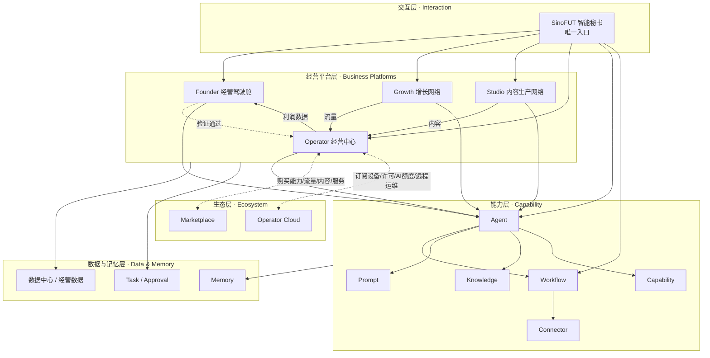
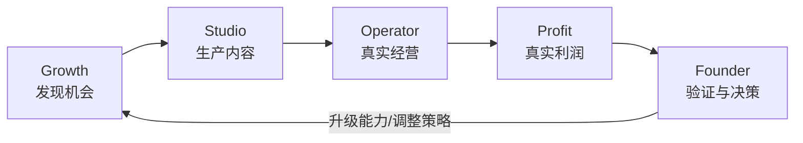
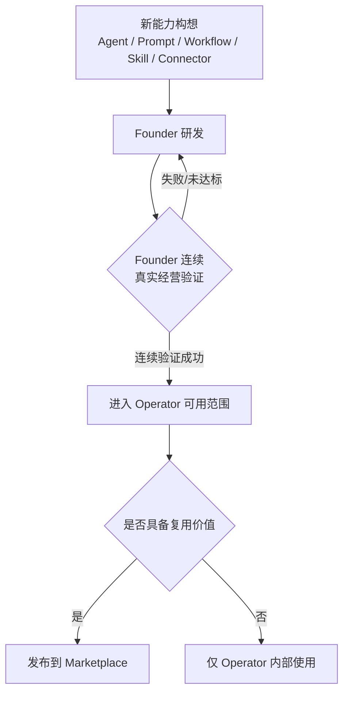

# AI Commerce OS 2608·V2 总体架构（Architecture）

状态：初稿，待 Founder 确认。
品牌：**SinoFUT** ｜ 系统：**AI Commerce OS** ｜ 版本：**2608·V2**

---

## 1. 一句话定义

AI Commerce OS 不是软件，是**一个 AI 商业生态操作系统**。它的设计原点是"真实经营闭环"，不是"软件功能分类"。
一切架构决策，先问："这是否让 Founder 今天的经营更真实、更快、更赚钱？"，再问技术上如何实现。

## 2. 系统边界（做什么 / 不做什么）

延续 [`vision.md`](../00-project/vision.md) 的立业初心，AI Commerce OS **是**：

- 一套让一个人通过 AI Agent 同时运营多品牌、多店铺、多平台、多国家生意的操作系统。
- 人负责判断、创意、担责的决策（策略、选品、品牌、供应链、资金、风险、终审）。
- AI 负责一切可重复的执行（调研、选题、生成、发布、客服、履约、分析、复盘）。

AI Commerce OS **不是**：

- 传统 ERP / 通用 SaaS 后台 / 单纯的工作流编辑器 / 聊天机器人产品。
- 不以"把所有页面做出来"为目标；页面是经营闭环的副产品，不是目标本身。

## 3. 五大主体（系统的"人格"）

系统由五个具备独立职责边界的主体组成，彼此不是上下级关系，而是 **Founder 孵化出的协作网络**：

| 主体 | 身份 | 核心职责 | 对外产出 |
|---|---|---|---|
| **SinoFUT** | 唯一智能入口 / 系统秘书 | 对话、任务规划、Agent/Workflow 调度、Memory、Approval、决策建议 | 让其余四个主体"可被一句话调用" |
| **Founder** | 创始人 / 第一验证中心 | 研发能力、真实经营、真实生产、真实增长验证 | 验证通过的能力 → 交给 Operator |
| **Growth** | 增长网络 | 发现机会（热点/趋势/SEO/广告/选品）、建设流量资产（内容矩阵/私域/达人/渠道） | 流量 → 输出给 Operator |
| **Studio** | 内容生产网络（AI 内容公司） | 生产图文/视频/AI短剧/广告素材/数字人/品牌IP，自己也经营内容资产 | 内容 → 输出给 Operator |
| **Operator** | 经营者 | 经营店铺/商品/客户/广告/订单/客服/利润 | 利润 → 反哺 Founder 决策 |

Founder 不是"管理员"，而是同时叠加四个身份持续使用系统本身：**创始人（研发能力）／第一经营者（真实经营）／第一内容生产者（真实生产并发布）／第一增长验证者（真实验证增长）**。
一项能力只有被 Founder 连续经营验证成功后，才允许进入 Operator 的可用范围（见第 6 节"验证闸门"）。

### 3.1 SinoFUT 不是超级管理员（多租户与权限边界）

SinoFUT 是"统一内核 + 差异化配置与数据权限"的架构，不是拥有全量数据权限的单体超级管理员：

- **同一内核**：对话理解、上下文管理、Memory、任务规划、Agent/Workflow 调度、Tool 调用、审批申请、经营建议、数据总结、执行结果汇报，这一整套能力只实现一次。
- **不同实例 = 不同权限边界**：Founder Sino（全量视角）、Operator Sino（仅本租户/本店铺经营数据）、Studio Sino（仅内容生产数据）在部署时是同一内核加载不同的租户（Tenant）配置与角色（Role/Permission）范围，彼此不能越权读取对方数据。
- 这一约束从 V2 第一行代码起生效，不是后续补丁：多租户、设备（Device）、许可证（License）、权限（Role/Permission）等对象在 [02-domain-model.md](02-domain-model.md) 中定义，任何 Agent/Workflow 调度前必须先解析调用方所在的 Tenant 与权限范围。

### 3.2 Operator Cloud 的定位修订

第 4/7 节图中的 Operator Cloud，其职责在本轮审查后收窄为**设备、部署、版本、许可证、人工智能经营额度与远程运维的管控层**，而不是"流量/内容打包订阅目录"——后者已并入 Marketplace 的"服务市场"分区（见 [03-information-architecture.md](03-information-architecture.md) 2.7 节）。理由与详细收入结构见 [05-business-ecosystem.md](05-business-ecosystem.md) 第2节，冲突记录见 [07-foundation-review.md](07-foundation-review.md)。

## 4. 分层架构

**分层原则**：

- **交互层**只有一个：SinoFUT。任何能力、任何页面，都必须能通过 SinoFUT 调用，SinoFUT 不是"聊天机器人"，是四个业务平台 + 能力层的统一调度秘书。
- **经营平台层**的三个商业平台（Growth / Studio / Operator）平行存在，不互相隶属；Founder 驾驶舱是观察 + 决策 + 验证的场所，不是第四个"业务平台"，而是三者的孵化源头与仲裁者。
- **能力层**（Agent/Workflow/Prompt/Knowledge/Connector/Capability）是四个经营平台共享的底座，任何平台不得私有化能力层对象。
- **数据与记忆层**贯穿所有层：Memory 记录长期上下文，Task/Approval 记录待办与人工授权，数据中心汇总经营指标。
- **生态层**是系统对外开放的边界，但两个入口职责不同：**Marketplace** 是 Operator 购买 Studio 的内容、Growth 的流量、Capability 的能力、第三方服务的交易市场；**Operator Cloud** 是 Operator 部署实例本身的设备/版本/许可证/AI经营额度/远程运维管控层（见 3.2 节），二者不可混同。

## 5. 核心数据流：真实经营闭环

Phase 6 要打通的闭环，是整个系统唯一的"完工定义"：

对应到首页设计原则（宪章十二）：今天有什么机会 → 今天生产什么 → 今天经营什么 → 流量来自哪里 → 利润是多少 → 哪些能力需要升级，这六个问题就是这条闭环在 Founder 驾驶舱上的每日呈现。

## 6. 验证闸门（能力晋升机制）

这是本系统与传统软件最大的架构差异：**能力不是"发布即可用"，而是"验证通过才可用"**。

任何页面、Agent、Prompt、Workflow、Skill、Connector、Capability，未经过 Founder 本人真实经营验证，不得进入 Operator 版本。

## 7. 与 V1 的关系

- V1（`docs/01-reference-architecture`、`docs/03-domain`、`docs/02-specification`、`frontend/src/console` 等）**保留为历史版本**，仅供参考，**不是** V2 的架构基础。
- V2 领域模型、导航结构、页面组件如与 V1 冲突，**直接废弃 V1 对应部分**，不做兼容层、不做迁移适配。
- V1 中被验证为"通用 UI 模式"而非"业务架构"的内容（例如某些交互细节）可以被重新评估是否保留，但**不能作为默认继承项**——每一处沿用都必须在 V2 文档中重新论证，而不是隐式带入。

## 8. 开发顺序（本轮四份文档对应 Phase 1-4）

| Phase | 交付物 | 状态 |
|---|---|---|
| 1 | 领域模型 | 本轮完成 → [02-domain-model.md](02-domain-model.md) |
| 2 | 信息架构 | 本轮完成 → [03-information-architecture.md](03-information-architecture.md) |
| 3 | 导航系统 | 本轮完成（并入信息架构文档） |
| 4 | 设计系统 | 本轮完成 → [04-design-system.md](04-design-system.md) |
| 5 | 系统框架（Application Shell） | 等待确认后启动 |
| 6 | 打通 Growth → Studio → Operator → Profit → Founder 闭环 | 等待确认后启动 |

**在 Founder 确认以上四份文档前，不开始任何具体页面开发。**
