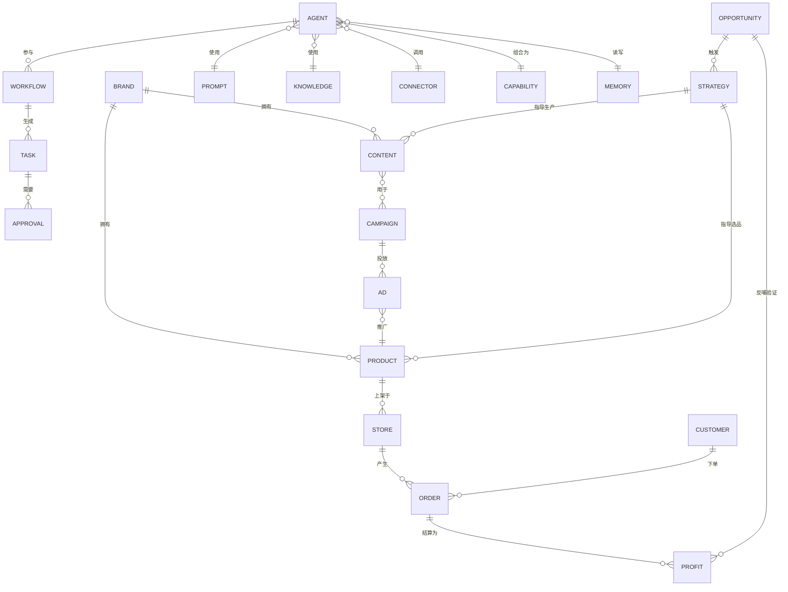

# AI Commerce OS 2608·V2 领域模型（Domain Model）

状态：初稿，待 Founder 确认。

本文件定义 V2 的核心业务对象及其关系，**不兼容、不迁移** V1 的领域模型（`docs/03-domain/D-00x-*.md`）。
如与 V1 冲突，以本文件为准，V1 对应对象视为废弃。

## 1. 领域分组

核心对象分为四组：**经营对象**（业务实体）、**生产对象**（内容与增长资产）、**能力对象**（AI 基础设施）、**治理对象**（记忆/任务/审批）。

## 2. 经营对象（Business Objects）

| 对象 | 定义 | 关键属性 | 生命周期状态 | 归属主体 |
|---|---|---|---|---|
| **机会 Opportunity** | Growth 发现的一个可被验证的商业假设（热点/趋势/选品/SEO/广告/内容机会） | 类型、来源信号、预估规模、置信度、关联品类 | 发现 → 评估 → 验证中 → 验证通过/淘汰 | Growth |
| **策略 Strategy** | 针对某个机会制定的行动方案，连接内容生产与选品/定价决策 | 目标机会、假设、动作计划、成功指标 | 草拟 → 执行中 → 复盘 | Founder / Growth |
| **内容 Content** | Studio 生产的任意内容资产（图文/视频/短剧/素材/详情页/数字人形象） | 类型、格式、关联品牌、关联商品、版权归属、发布渠道 | 构思 → 生产中 → 待发布 → 已发布 → 归档 | Studio |
| **品牌 Brand** | 一个可被独立经营的品牌资产，拥有自己的内容与商品 | 名称、定位、视觉资产、所属店铺集合 | 孵化 → 运营中 → 沉淀/停用 | Founder / Operator |
| **商品 Product** | 可售卖的 SKU/SPU，携带选品依据与内容资产引用 | 品类、定价、供应链来源、关联内容、关联店铺 | 选品 → 上架 → 在售 → 下架 | Operator |
| **店铺 Store** | 一个平台上的经营主体（如某个抖音小店/亚马逊店铺） | 平台、所属品牌、商品集合、经营指标 | 开店 → 运营中 → 暂停/关闭 | Operator |
| **客户 Customer** | 与经营主体产生过交互的终端用户 | 来源渠道、生命周期阶段、私域标签、订单历史 | 潜客 → 首单 → 复购 → 流失 | Operator / Growth（私域） |
| **活动 Campaign** | 面向机会/策略的一次内容+广告组合行动（如一次选题矩阵投放） | 关联策略、内容集合、广告集合、周期 | 策划 → 执行中 → 复盘 | Growth / Studio |
| **广告 Ad** | 单条广告投放实例 | 渠道、预算、素材（引用 Content）、目标商品 | 创建 → 投放中 → 暂停/结束 | Operator（购买）/ Growth（供给） |
| **订单 Order** | 一次交易 | 商品、客户、金额、履约状态 | 下单 → 支付 → 履约 → 完成/退款 | Operator |
| **利润 Profit** | 经营结果的财务归集，是验证闭环的终点 | 周期、收入、成本、净利、归属品牌/店铺 | 结算 → 归档 → 反哺验证 | Operator → Founder |

## 3. 能力对象（Capability Objects）

| 对象 | 定义 | 关键属性 | 归属层 |
|---|---|---|---|
| **Agent** | 一个可被调度的自主执行单元，绑定 Prompt/Knowledge/Connector 完成特定职责 | 职责域、绑定 Prompt、绑定 Knowledge、绑定 Connector、验证状态 | 能力层 |
| **Workflow** | 多 Agent/多步骤的编排流程，由事件触发 | 触发事件、步骤图、涉及 Agent、人工审批点 | 能力层 |
| **Prompt** | Agent 行为的核心指令资产 | 版本、适用 Agent、评测记录 | 能力层 |
| **Skill** | 可复用的技能单元（比 Prompt 更结构化，可含代码/工具调用逻辑） | 输入输出契约、依赖的 Connector | 能力层 |
| **Knowledge** | Agent 可检索的知识资产（品类知识、平台规则、历史案例） | 来源、更新频率、适用范围 | 能力层 |
| **Connector** | 与外部平台/系统对接的适配器（抖音/淘宝/亚马逊/支付/物流等） | 平台、鉴权方式、可用能力范围 | 能力层 |
| **Capability** | Agent/Workflow/Prompt/Skill/Connector 组合后对外暴露的一项"可调用能力"，是验证闸门的最小单位 | 组成清单、验证状态、适用范围（仅 Founder / 已开放 Operator） | 能力层 → 治理 |
| **Version** | 任何能力对象的版本快照，支撑回滚与对比 | 对象类型、版本号、变更说明 | 能力层 |

## 4. 治理对象（Governance Objects）

| 对象 | 定义 | 关键属性 |
|---|---|---|
| **Memory** | SinoFUT 及各 Agent 的长期上下文记忆 | 作用域（全局/主体/会话）、来源、过期策略 |
| **Task** | 任何需要被追踪到完成的工作单元（人工或 AI） | 来源（Workflow/人工创建）、负责人（人或 Agent）、状态 |
| **Approval** | 人工审批节点，是"人类是最终权威"原则的落地机制 | 触发条件、审批人、时限、关联 Task/Workflow |

## 4.1 部署与权限对象（Deployment & Permission Objects）

V2-001 任务新增（原六份文档未覆盖，属本轮修订新增，详见 [07-foundation-review.md](07-foundation-review.md)）：

| 对象 | 定义 | 关键属性 | 归属层 |
|---|---|---|---|
| **Tenant（租户）** | 一个独立的数据与权限边界，对应一个 Founder Sino / 一个未来的 Operator 使用者部署实例 | 名称、所属 Founder、启用的 Workspace 范围、数据隔离策略 | 治理 |
| **Role / Permission（角色与权限）** | 定义某个身份（Founder Sino / Operator Sino / Studio Sino 等）在某个 Tenant 下可读写的对象范围 | 角色名、可访问对象类型、可执行动作、所属 Tenant | 治理 |
| **Device（设备）** | Operator Cloud 管控的一个运行实例（云端容器或本地一体机） | 设备标识、绑定 Tenant、运行版本、在线状态、故障状态 | Operator Cloud |
| **License（许可证）** | 一个 Tenant/Device 的授权凭证，决定可用 Workspace 与能力范围 | 授权类型、有效期、绑定 Tenant/Device、状态 | Operator Cloud |
| **AIQuota（人工智能经营额度）** | 某个 Tenant 在一个计费周期内的模型调用/Agent 执行额度 | 额度总量、已用量、计费周期、告警阈值 | Operator Cloud |

**关系约束补充**：Agent/Workflow 被调度前必须先解析发起方所在的 Tenant 与 Role/Permission，跨 Tenant 的数据访问一律拒绝；AIQuota 耗尽时，Workflow 调度必须优雅降级（排队或提示，而非静默失败）。

## 5. 关键关系约束

1. **机会 → 策略 → 内容/商品** 是单向驱动：内容与选品必须能追溯到一个机会或策略，禁止"为做内容而做内容"。
2. **利润 → 机会** 形成闭环反馈：每个机会最终必须能被利润数据验证或证伪，这是 Founder 验证中心的核心机制。
3. **Capability 是唯一的"能力晋升"载体**：Agent/Workflow/Prompt/Skill/Connector 不能单独进入 Operator 可用范围，必须先组合并标记为已验证的 Capability。
4. **品牌可跨 Operator 店铺存在**，但一个店铺只属于一个品牌；Studio 生产的内容默认归属品牌，而非归属单个店铺。
5. **Growth 产出流量而不直接持有客户**：客户对象归属 Operator，Growth 通过私域渠道标签与 Operator 的客户对象关联，不重复建模。

## 6. 与 V1 领域模型的差异说明

V1（`docs/03-domain/D-001~D-007`）以"商品/订单/库存/客户/平台/知识"六个后端领域为核心，是电商 ERP 视角。
V2 在此基础上**新增机会、策略、内容、品牌、活动、利润、Capability、Memory、Task、Approval** 等对象，
并将"验证闭环"作为一等公民，而不是把系统视为电商后台的领域集合。V1 的 Product/Order/Customer/Inventory
等对象的字段级设计可在后续详细设计阶段参考其数据完整性经验，但对象边界与关系以本文件为准。
