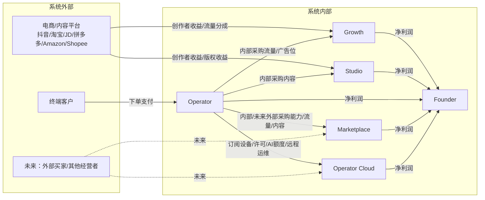
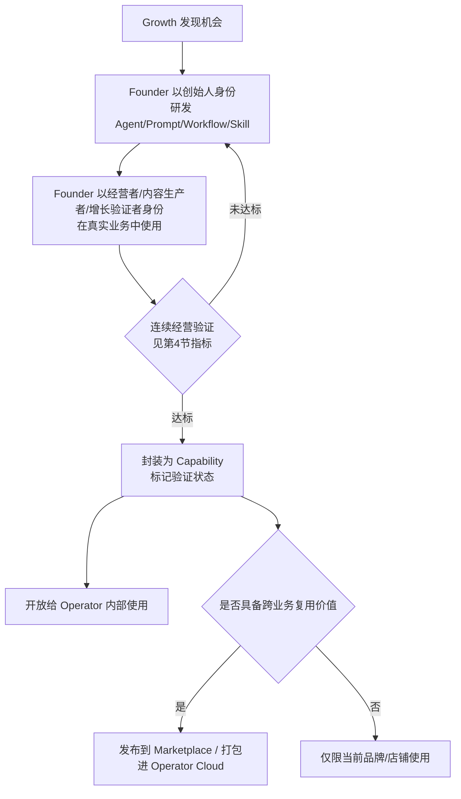
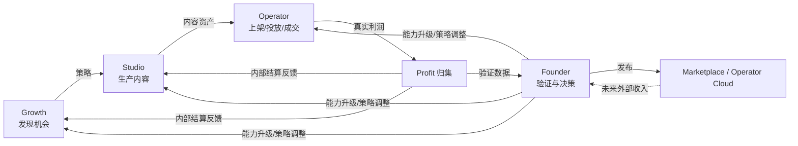

# AI Commerce OS 商业生态设计（Business Ecosystem Design）

状态：初稿，待 Founder 确认。承接 [01-architecture.md](01-architecture.md) 的分层架构与 [02-domain-model.md](02-domain-model.md) 的领域对象，本文件回答一个架构文档没有回答的问题：**钱和能力具体怎么在七个主体之间流动**。

## 1. 七个主体的商业角色

| 主体 | 商业角色 | 是否独立核算 |
|---|---|---|
| **Founder** | 资本配置者 + 最终验证者，不对内部交易收费 | 汇总核算（合并报表视角） |
| **SinoFUT** | 共享基础设施 / 成本中心，不直接产生收入 | 成本项，分摊到四个平台 |
| **Growth** | 流量资产运营方 | 独立核算 |
| **Studio** | 内容资产运营方 | 独立核算 |
| **Operator** | 商品/店铺经营方，系统中唯一直接面对终端客户收款的主体 | 独立核算 |
| **Marketplace** | 能力/内容/服务的交易撮合方 | 独立核算（未来） |
| **Operator Cloud** | Operator 部署实例的设备/版本/许可证/AI经营额度/远程运维供给方（本轮修订，见 [07-foundation-review.md](07-foundation-review.md)） | 独立核算（未来） |

**为什么要"独立核算"，即便现在只有一个 Founder**：只有让 Growth/Studio/Operator 像三家独立公司一样被核算利润，Founder 才能验证"哪个平台真正创造价值"，而不是把整个系统当成一个模糊的成本黑箱。这是宪章"验证经营"原则在财务上的落地，不是为了真的做多租户。

## 2. 利润来源（谁的钱从哪里来）

| 主体 | 真实现金收入来源 | 内部结算收入来源 |
|---|---|---|
| Growth | 平台创作者分成、达人网络分佣、私域转化佣金 | Operator 为购买流量/广告位支付的内部结算价 |
| Studio | 平台创作者收益、内容版权授权收入、自有矩阵账号广告分成 | Operator 为采购内容支付的内部结算价 |
| Operator | 终端客户订单收入 | 无（Operator 是内部结算的最终付款方，不向其他主体收内部费用） |
| Marketplace | 未来：外部交易佣金（能力/内容/服务的成交抽成） | 当前阶段：仅记录内部撮合，不产生真实抽成 |
| Operator Cloud | 未来：外部设备/部署/许可证/AI经营额度/远程运维订阅费 | 当前阶段：向 Founder 内部结算设备与运维成本，无外部买家，仅作账务演练 |
| SinoFUT | 无收入，计入四个平台的算力/工程分摊成本 | — |
| Founder | 四个平台净利润汇总 - SinoFUT 分摊成本 - Founder 自身研发投入 | — |

**内部结算价**不是真实发票，而是 Founder 用来衡量"这个能力/这份内容/这批流量到底值多少钱"的记账机制，是第 4 节验证机制的数据输入。

### 2.1 持续收入九分类（第零原则的落地口径）

任何新功能立项前必须能回答"它未来对应什么持续收入"（V2-001 任务第零原则）。以下九类是当前已识别的持续收入形态，新功能应尽量落在其中一类，落不进任何一类的功能需要额外说明其战略价值：

| 收入类别 | 主要归属主体 | 对应对象/机制 |
|---|---|---|
| 设备与部署收入 | Operator Cloud | Device |
| 系统许可收入 | Operator Cloud | License |
| 人工智能经营额度收入 | Operator Cloud | AIQuota |
| 内容服务收入 | Studio（经 Marketplace 交易） | Content |
| 增长与流量服务收入 | Growth（经 Marketplace 交易） | Campaign、私域/渠道资产 |
| 广告服务收入 | Operator（投放执行）/ Growth（渠道供给） | Ad |
| 能力商城收入 | Marketplace | Capability |
| Operator Cloud 服务收入 | Operator Cloud | Device/License/AIQuota 的订阅打包 |
| 远程运维收入 | Operator Cloud | Device 的故障处理与升级服务 |

## 3. 能力流转（Capability Flow）

能力（Agent/Prompt/Skill/Workflow/Knowledge/Connector 组合成的 Capability）在七个主体间的流转路径，是对架构文档"验证闸门"的商业化展开：

**关键规则**：

1. 能力永远从 Founder 的"自用"开始，不允许从 Marketplace 或外部采购的能力直接进入 Operator 而跳过 Founder 自身验证。
2. 一旦 Capability 被打包发布，Growth/Studio 就从"生产内容/流量的团队"同时变成"生产能力的团队"——例如 Studio 沉淀出的一套数字人生产 Workflow，本身也可以成为 Marketplace 上的商品。
3. Operator Cloud 的本质是"把 Growth 和 Studio 的能力打包成可订阅的服务"，因此 Operator Cloud 没有自己的原创能力，只有编目、计价与交付。

## 4. 验证机制（业务口径）

架构文档定义了"验证闸门"的流程位置，这里定义**验证通过的具体判定口径**，作为 Founder 决策的默认基线（可在实践中调整，但需要显式记录调整原因）：

| 判定维度 | 基线标准 | 说明 |
|---|---|---|
| 连续性 | 连续 ≥7 个自然日由 Founder 本人真实使用/真实经营 | 避免单次成功被误判为可推广能力 |
| 财务信号 | 内部结算口径下产生正向净利润，或明确的可量化效率提升（如时间节省 ≥X 小时/周） | 对应第 2 节的内部结算价 |
| 人工介入率 | 人工修正/否决的比例低于设定阈值（如 <20%），且呈下降趋势 | 用 Approval 对象的历史记录衡量 |
| 可复现性 | 换一个品类/店铺/内容形式后，效果不显著衰减 | 避免过拟合单一场景 |

四项全部满足 → Capability 标记为"已验证"，进入第 3 节的封装流程。任一项不满足 → 退回研发迭代，Version 对象记录本轮失败原因，供下一轮参考，不允许静默重试。

验证结果与第 3 节的流转、第 2 节的内部结算价共同写入 Founder 驾驶舱的"能力升级"分区（见 [03-information-architecture.md](03-information-architecture.md) 2.2 节），保证验证不是一份孤立报告，而是每日可见的经营信号。

## 5. 经营闭环的完整回路

这条回路与架构文档第 5 节的闭环是同一条，本文件补充了"钱"和"能力"两条具体的流转内容，是 Phase 6（打通真实经营闭环）验收时唯一需要对照的业务模型。

## 6. 与 V1 的关系

V1 没有"内部结算""平台独立核算""能力流转到 Marketplace/Cloud"的设计，是纯电商运营视角。本文件不兼容、不参考 V1 的任何财务或权限模型，仅以 [02-domain-model.md](02-domain-model.md) 的 Profit / Capability / Version 对象为基础重新设计。
